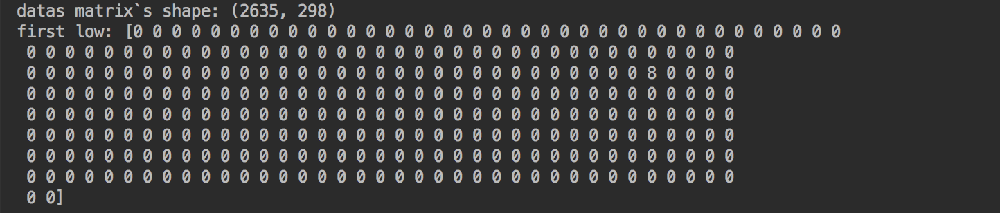
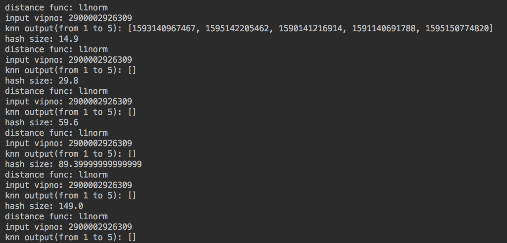
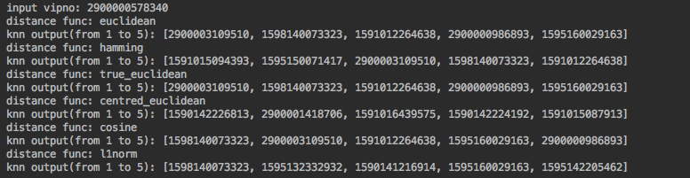

## 代码运行结果

**a)**



在将trade文件中的记录按照vipno分组后，并且转为一个矩阵，pluno为行，vipno为列。该矩阵的维度为$(2635,298)$ ，如截图所示。

该矩阵第一行输出后，如截图所示。

**b)**



选择`distance func`为`l1norm`时，当`hash_size`分别为全体vipno(非重复)总数的$0.01, 0.05, 0.1, 0.2, 0.3, 0.5$时的某一随机vipno对应knn的输出vipno，如截图所示。



当`hash_size`分别为全体vipno(非重复)总数的$0.01$时，不同的`distance func`某一随机vipno对应knn的输出vipno，如截图所示。

⚠️：以上的输出都是剔除了输入的vipno自身。

## 分析讨论

下面的分析讨论主要从，`LHash`包提供的6种距离函数、`hash_size`与输出的关系，以及一些与代码相关的小点。

### 距离函数

`LHash`一共提供了6种距离函数，其源代码可见[这里](https://github.com/kayzhu/LSHash/blob/master/lshash/lshash.py)。源代码中关于`distance func`参数（即距离函数）的描述如下：

```python
"""
:param distance_func:
            (optional) The distance function to be used. Currently it needs to be one of ("hamming", "euclidean", "true_euclidean", "centred_euclidean", "cosine", "l1norm"). By default "euclidean" will used.
"""
```

这里对每一种距离函数做一个简单的阐述：

**`hamming`**：即汉明距离，通常用于计算两个等长字符串的对应位置的不同字符的个数，以不同数作为距离。

**`cosine`**：即余弦距离，简单来说就是向量空间中两个向量夹角的余弦值作为衡量两个个体间差异的大小的度量。

**`euclidean`**、**`true_euclidean`**、 **`centred_euclidean`**：这里给出了三种“欧式距离”，参考源代码可以发现，**`true_euclidean`**是真正的欧式距离，**`euclidean`**是欧式距离的平方，**`centred_euclidean`**则是`diff = np.mean(x) - np.mean(y)`，即求得一个均值后，在计算欧式距离的平方。

**`l1norm`**：即曼哈顿距离，为两个点在标准坐标系上的绝对轴距总和。

我们知道，主要运用到高维海量数据的快速近似查找。而近似查找通常是基于距离或者相似度的。如果说的更加详细一点，是，高维空间的两点若距离很近，那么设计一种哈希函数对这两点进行哈希值计算，使得他们哈希值有很大的概率是一样的。同时若两点之间的距离较远，他们哈希值相同的概率会很小。

我比较了这篇博客，[Locality Sensitive Hashing归总](http://jacoxu.com/locality-sensitive-hashing%E5%BD%92%E6%80%BB/)和MIT官网上一个关于LSH的各种论文整理 —— [LSH Algorithm and Implementation (E2LSH)](http://www.mit.edu/~andoni/LSH/)。大概理出了关于LSH的研究论文的从老到新的一个路程。最早LSH算法中所运用到的距离是汉明距离，具体的论文为[Approximate Nearest Neighbors: Towards Removing the Curse of Dimensionality](http://www.cs.princeton.edu/courses/archive/spr04/cos598B/bib/IndykM-curse.pdf)。对应海明距离的LSH称为位采样算法（bit sampling），主要是用于对文章、新闻等相似度的比较，结合到其涉及的数据主要是字符串，这样做是合理的。随后又提出了新的曼哈顿距离、欧式距离的方法。

那么我们到底应该在这里选择什么距离函数呢？事实上，我查了很久并没有找到关于描述LSH中不同距离函数对于聚类的影响的文章……那么我在这里的考虑是，暂时不看LSH，单纯从我们现在的数据 —— 高维且十分稀疏（存在大量的0）来考虑。

我在StackExchange上找到了这么一个讨论，[Euclidean distance is usually not good for sparse data?](https://stats.stackexchange.com/questions/29627/euclidean-distance-is-usually-not-good-for-sparse-data)，其中有这样一个解释，让我们来欧式距离的计算公式
$$
|x-y|^2 = |x|^2 + |y|^2 - 2xy
$$
当数据十分稀疏的时候，我们可以近似地认为$x·y$是约等于0的，显然这样计算出来的欧式距离是不理想的。曼哈顿距离与欧式距离存在同样的类似问题。[这里](https://dataminingguide.books.yourtion.com/chapter-2/chapter-2-3.html)提出了一个更为详细的例子来解释这个问题。

假设有A、B、C三个人，A很喜欢乡村音乐，BC很喜欢摇滚乐，而他们都对100首音乐打过分。

B和C的评分列表中有20首相同的的歌曲，且评分均值相差不到0.5！所以他们之间的曼哈顿距离为20 x 0.5 = 10，欧式距离则为2.236。

然而A和C只对一首歌有相同评分，A打了3分，B打了5分。这样计算得到的曼哈顿距离和欧式距离则都为2。显然，这是一个错误的结论。


具体输出结果可以发现，选择不同的距离函数得到的输出结果，是存在差异的。

### hash_size对于输出的影响

`hash_size`在源代码中的解释是

```python
"""
:param hash_size:
        The length of the resulting binary hash in integer. E.g., 32 means the resulting binary hash will be 32-bit long.
"""
```

详细看源代码的话会发现它用来创建了一个`hash_size` * `input_dim`的矩阵，`uniform_planes`，然后和输入的`input_point`相乘。说人话的话，就是将原来输入的高维数据，降维到了`hash_size`维。

个人在这里的理解是，除了0.01这个系数，其他的系数乘以vipno（非重复）总数之后`hash_size`都不小，也就是说维度并没有下降很多。而由于这份数据又是及其稀疏的，那么在高维度上来看，数据之间的距离比较远，也就是说关联度不大，并没有达到源代码中设置的阈值，从而最终的候选集是空的。

不过我没有找到源代码中关于阈值设置的函数，或者说是我没有看懂。:）

