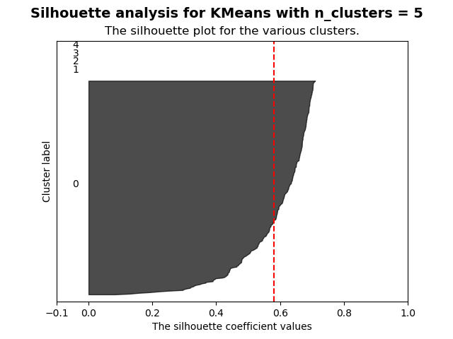
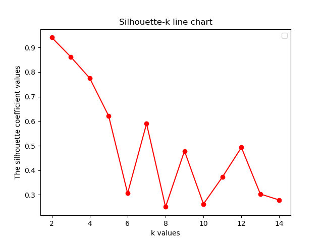

## 代码运行结果

**a)**

以k值为横轴、`Silhouette`系数值为y轴，`Silhouette`系数值-k值的函数图。可以看出$k=2$的时候，`Silhouette`系数分数最高，说明该情况下分类最好。下面几张图是当`n_cluster`为某一具体值时，每一个数据的分类情况。

当`n_cluster`为$2，5，8，12，13$时，`Silhouette`系数对分类的评价情况。可以看出`n_cluster=2`的时候，`Silhouette`系数最大，分类最高。

**b)**

之前lsh的knn查询结果与输入vipno所在簇的分布情况，可以看到都在同一个簇以内。事实上，从**a)**的结果可以看出，Kmeans算法将大部分数据（也可以说是全部）都分在同一个簇内，所以得到这样的结果是不足为奇的。

## 分析讨论

下面主要讨论的是K值的选择、与lsh的knn查询结果的比较、针对`sklearn`提供的Kmean函数部分参数说明。

### K值的选择

其实K值的选取在Kmeans算法中并不好把握，我这里采用的是作业中要求的`Silhouette`系数，根据其大小对K值进行选取。

这里简单说一下`Silhouette`系数计算的一个流程：

1. 计算样本i到同簇其他样本的平均距离$a_{i}$。$a_{i}$越小，说明样本i越应该被聚类到该簇。将$a_{i}$称为样本$i$的**簇内不相似度**。 **簇$C$中所有样本的$a_{i}$均值称为簇$C$的簇不相似度。**

2. 计算样本i到其他某簇$C_{j}$的所有样本的平均距离$b_{ij}$，称为样本$i$与簇$C_{j}$的不相似度。定义为样本$i$的**簇间不相似度**：$b_{i} =min(b_{i1},b_{i2},…,b_{ik})$ $b_{i}$**越大，说明样本$i$越不属于其他簇。**

3. 定义样本$i$的**轮廓系数**：

   ​
   $$
   s_{i} = \frac{b_{i}-a_{i}}{max(b_{i},a_{i})}
   $$

4. $s_{i}$接近1，则说明样本$i$聚类合理； $s_{i}$接近$-1$，则说明样本$i$更应该分类到另外的簇；若$s_{i}$近似为0，则说明样本$i$在两个簇的边界上。

`sklearn`提供了直接计算`Silhouette`系数的方法，经过计算后作出的折线图和`n_cluster`为某一具体值时，`Silhouette`系数对于每一个数据的图如前面所示。显然我们可以看出，当K取到2的时候，系数的得分越接近1。虽然说整个系数图在左侧，仍然有上申的趋势，但是K不可能再取到1了，这样就没有了意义，所以单纯从`Silhouette`系数来看，K取2是一个很好的选择。

### 与lsh的knn查询结果的比较

这里的比较虽然我们可以得出，比较之前lsh的knn查询结果与输入vipno所在簇的分布情况，可以看到都在同一个簇以内，但得出这样的结论存在着一个问题，这主要是因为Kmeans将所有的数据基本上都聚到了同一个类中。

对于为什么Kmeans聚类效果不好，参考了数据的实际情况后，我还是认为数据的原因，把**q1**问的矩阵提取出来进行分析，会发现针对某一个用户，基本上都是只购买了2000多种商品中的极少几种，而且也没有都喜爱的商品，这一点可以通过如下的统计来反映：

这张图统计了对于每一件商品，其被购买的次数。绝大部分的商品被购买的次数都是集中在0-10次。

这张图统计了不同用户的购买次数，可以看出来是十分分散的。

当然，上述的结果只是一个感性的简单分析，不能算是十分的准确，不过总的来说，结论就是数据的稀疏以及不相关性较大导致了Kmeans的聚类结果。

### 部分参数说明

- `init`：即初始值选择的方式，这里较好的方式是`k-means++`。它主要是对初始的K个质心进行了选择优化，这样优化了聚类时间，算法收敛时间会加快。
- `algorithm`：有`auto，` `full`，`elkan`三种选择。`elkan`主要是利用了两边之和大于等于第三边,以及两边之差小于第三边的三角形性质，来减少距离的计算。通过预先计算两个质心之间的距离，能够减少计算。但是这个是适用于数据比较稠密的时候，对于这份数据，是不合适的。

## 性能比较

这里简单对`k-means++`和完全随机选择初始的K个质心之间时间进行比较。结果如下

总的来说，K越少时间越快；`k-means++`比完全随机要稍微快一些，但是由于数据量不大，看起来不明显。

接下来是对`algorithm`使用 `full`，`elkan`的比较，第一张图是 `full`，第二张图是`elkan`。

总的来说差异不大，选择`full`稍微较好，不过这个结果受到了数据的影响。