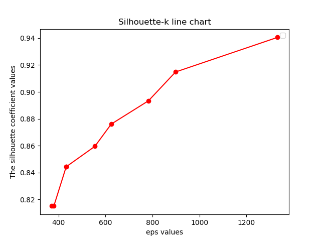
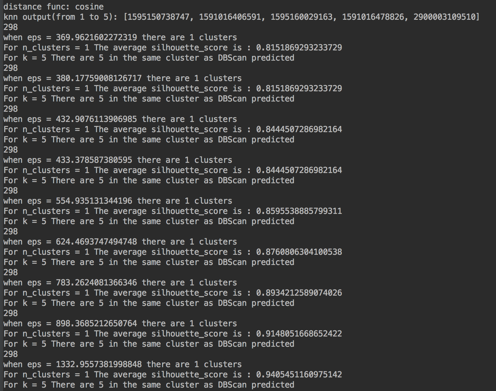
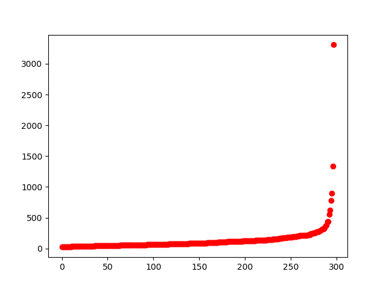

## 代码运行结果

**a)**

以k值为横轴、`Silhouette`系数值为y轴，画出的`Silhouette`系数值-k值函数图。可以看出当k值逐步上升的时候，`Silhouette`系数一直在上升，但是事实上，我发现DBScan算法始终将数据分为1类，所以继续加大eps值的意义不大，我勉强认为eps值取$eps=1332$时最好。

之前lsh的knn查询结果与输入vipno所在簇的分布情况，可以看到都在同一个簇以内。事实上，DBScan算法将全部数据都分在同一个簇内，所以得到这样的结果是不足为奇的。

## 分析讨论

下面主要讨论的是eps值的选择、与lsh的knn查询结果的比较。

### eps值的选择

DBScan算法需要用户提供两个参数，一个是`eps`半径，一个是`minPts`以点P为中心的邻域内最少点的数量。数量我们可以考虑使用遍历或者其他方式比较容易的求取最优值，但是对于半径来说，如果去做遍历，就会存在两个问题，一是不好确定范围；二是理论上来说，半径范围应该是稠密的，我很难说取到完全遍历这个范围内的半径值。

我对于`eps`的选择参考了这篇文章，[DBSCAN聚类算法原理及其实现](http://shiyanjun.cn/archives/1288.html)。里面提出了一个k-距离变化趋势图的方法。方法步骤我简单描述一下：

1. 计算每个点与其他所有点之间的欧几里德距离。
2. 计算每个点的k-距离值，并对所有点的k-距离集合进行升序排序，输出的排序后的k-距离值。
3. 将所有点的k-距离值，在Excel中用散点图显示k-距离变化趋势。
4. 将急剧发生变化的位置所对应的k-距离的值，确定为半径Eps的值。

原文是利用`Java`实现的，我在这里利用`Python`做了一个实现，详细代码可见提交的代码中`eps`函数。最后的k-距离变化趋势图如下：

这里的Y轴是对应的k-距离值，X轴坐标点我们直接使用递增的自然数序列，每个点对应一个自然数。从图像上感性来看，`eps`的取值在$300 - 1500$左右变化很快，因此我最后取的也是这一个范围内的k-距离值。最后的`Silhouette`系数值-k值函数图（见开头）也说明了`Silhouette`系数是比较高的，那么这样做是合理的。

### 与lsh的knn查询结果的比较

我这里发现了一个问题，DBScan将所有的数据都分在了同一类，和Kmeans一样，所以我就觉得好奇怪，感觉这不应该是算法的问题，于是我尝试利用了`t-SNE`算法把数据做了降维，从而可以可视化，得到的结果如下：

从上图可以很明显的看出来，除了极个别的噪音值，大部分数据都聚集在了一块……所以两种算法都分不出来，也是正常的。或者可以说，根据数据实际的分布情况，两种算法得到的结果，是合理的。

`t-SNE`就是一种数据降维的算法，其成立的前提是基于这样的假设：尽管现实世界中的许多数据集是嵌入在高维空间中，但是都具有很低的内在维度。代码我是参考的这个文章，[t-SNE高维数据可视化（python）](https://blog.csdn.net/AUTO1993/article/details/78689962)。

