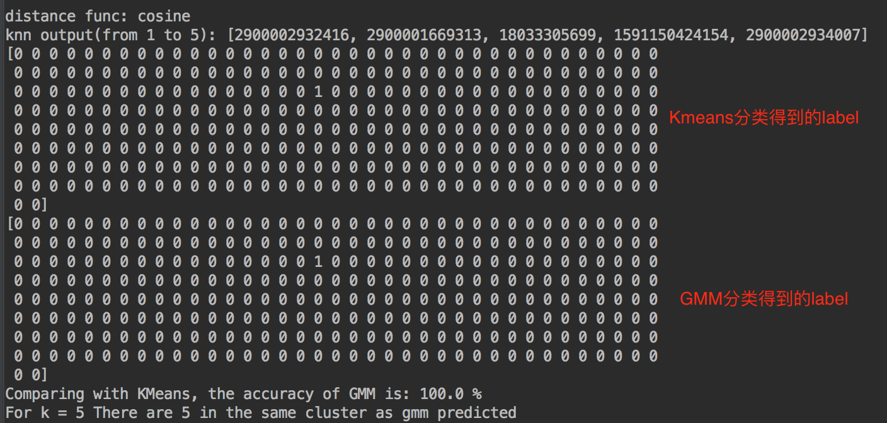
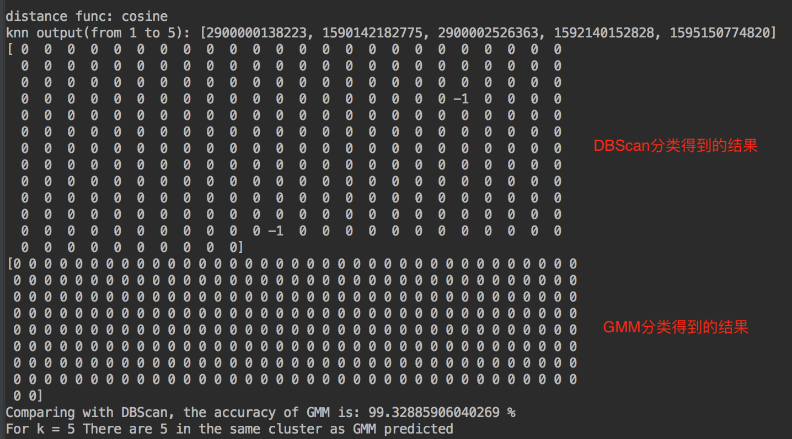
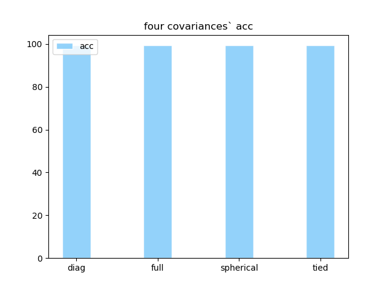
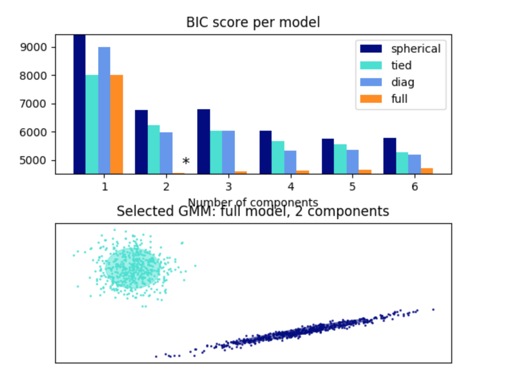

## 代码运行结果

**a)**

假定以Kmeans作为真实的聚类结果，计算得到的GMM的准确率(accuracy)。最下面是GMM预测的结果与上述lsh的knn查询结果进行比较。

**b)**

假定以DBScan作为真实的聚类结果，计算得到的GMM的准确率(accuracy)。最下面是GMM预测的结果与上述lsh的knn查询结果进行比较。

**c)**

由前面两张图可以得到，GMM预测的结果与上述lsh的knn查询结果是相符合的。

## 分析讨论

下面主要讨论的是sklearn包中`GaussianMixture`相关参数、GMM准确率的结果。

### sklearn包中`GaussianMixture`相关参数

- `n_components`：混合高斯模型个数，在GMM中，其实K个Component实际上对应K个cluster。题目要求的是假定前面两种算法的结果作为真实的聚类结果，那么`n_components`就和前面两个算法对应的K值一样即可。
- `covariance_type`：GMM算法中用到的协方差矩阵。协方差矩阵的用处主要是在高维的时候，能够很好的反映数据的性质。这里提供了四种`full`，`tied`，`diag`，`spherical`。具体的选择和介绍在`sklearn`有详细介绍，我在最后也有做性能比较。

### GMM准确率的结果

最开始的时候，我发现多次运行得到的GMM准确率的结果一直是两个极端，接近$100\%$，或者接近$0\%$，这显然是不科学的。后来经过查找输出的具体label，我发现是因为没有对两次的分类结果统一标签而导致的。

在统一标签后，GMM准确率的结果都是接近$100\%$的。参考数据来说，除了极个别的的噪音点都是集中在一起的，那么得到这样的结果也是不足为奇的。具体的结果我在**q3**有过详细的阐述。

严格意义上来说，三种算法是不太好去比较的，因为它们的原理并不相同。Kmeans是基于距离来进行的分类，DBScan是基于密度来进行的分类，而GMM则是基于概率。

## 性能比较

这里将四种协方差矩阵的分类准确率进行一个比较，结果如下：

因为数据的情况摆在这里，所以使用四种协方差矩阵得到的acc值基本上都是一样的。`sklearn`官网给出的一个关于利用BIC（贝叶斯信息准则）来选择高斯混合的分量数（即上面提到的`n_components`）的[例子](http://sklearn.apachecn.org/cn/stable/auto_examples/mixture/plot_gmm_selection.html)。这里会发现`spherical`即球面协方差矩阵效果比较好。当然对于这个例子，也需要结果是建立在其数据是一份分类比较好的样例数据上面的。例子的结果如下：

